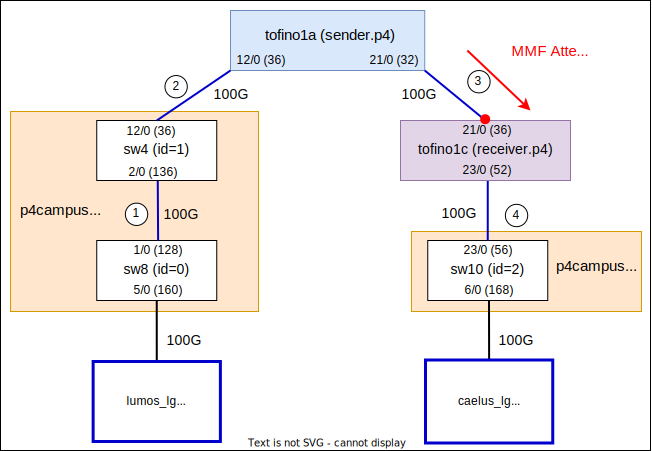
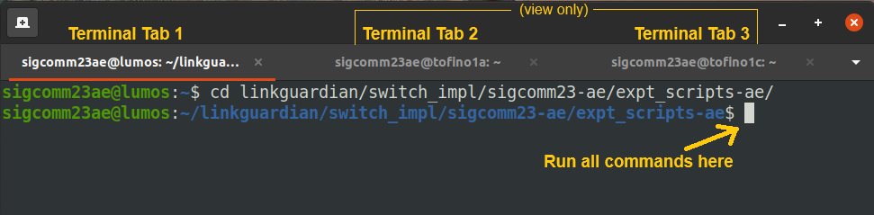

# LinkGuardian SIGCOMM'23 AE (switch implementation)

## Overview

The goal of this AE submission is to show that the switch implementation
artifact of LinkGuardian is *functional*. To that end, we provide scripts and
instructions to run *key* experiments from [our paper](https://rajkiranjoshi.github.io/files/papers/sigcomm23-linkguardian.pdf) on a real hardware testbed. The goal is to allow the artifact evaluators to produce *qualitatively* similar results in a reasonable amount of
time.

This README will guide you through the evaluation process which consists of the
following steps:
1. [Understanding and accessing the testbed setup](#understanding-and-accessing-the-testbed-setup) (5-7 mins)
2. [Compiling the P4 source code using Intel
   P4Studio](#compiling-the-p4-source-code) (3-4 mins)
3. [Setting up the topology](#setting-up-the-topology) (1-2 mins)
4. [Running switch-to-switch stress test experiment](#running-switch-to-switch-stress-test) (3-4 mins)
5. [Running the TCP FCT experiment](#running-the-tcp-fct-experiment) (18-20 mins)
6. [Running the RDMA FCT experiment](#running-the-rdma-fct-experiment) (5-6 mins)
7. [Running the throughput experiment](#running-the-throughput-experiment) (6-8
   mins)
8. [Cleaning up the testbed](#cleaning-up-the-tesbed) (< 1 min)

The estimated total time required is about **50-60 minutes**.

### System Requirements
This AE guide requires a testbed consisting of 2 server hosts and 3 Tofino1
switches.

<!-- Specifically, as shown in Figure 7 in the
[paper](https://www.comp.nus.edu.sg/~bleong/publications/sigcomm23-linkguardian.pdf),
this guide requires hosts h4 and h8 that are connected via switches sw8, sw4,
sw2, sw6, and sw10. Among these, as shown in Figure 7, sw2 is the LinkGuardian
sender switch while sw6 is the LinkGuardian receiver switch. -->
#### Testbed for artifact evaluation

To make it easy for the evaluators, we have setup the required testbed for
this artifact evaluation. We will communicate with the evaluators over HotCRP
about remotely accessing the testbed. In particular, we will be making the
following arrangements:
* We will be providing remote ssh access to our testbed consisting of 2 x86_64
physical servers and 3 Intel Tofino1 switches. 
* The evaluators will share a common user account with username `sigcomm23ae`. 
* At a given time, only a single evaluator will be able to run the evaluation.
We appreciate the coordination among the evaluators to *time-share* the testbed.


#### Code of Conduct
Nearly all experiments involved in this artifact evaluation require sudo access
to the switches as well as the servers. It is therefore impossible for us to put
in place any access restrictions (e.g. chroot jail) without affecting the
ability to evaluate this artifact. We therefore ***trust*** that the evaluators
will abide by the simple code of conduct that they will use this remote access
with sudo privileges for the ***sole purpose*** of evaluating this artifact.
They will not indulge in any unethical practices including but not limited to
installing trojans, disrespecting the privacy and confidentiality of other user
accounts, copying/distributing the licensed Intel P4Studio SDE, etc.

> [!IMPORTANT] 
> By signing up to evaluate this artifact submission, you are agreeing to abide
> by this code of conduct. This is a requirement by our IT department.


## Artifact Evaluation Process

### Understanding and accessing the testbed setup

*Estimated Time Required: 5-7 mins*

The following topology diagram shows the testbed setup that we have prepared for the
artifact evaluation.


<br>*Topology Diagram*

The cabling topology corresponds to the path h4-sw8-sw4-sw2-sw6-sw10 shown in Figure 7 in
[our paper](https://rajkiranjoshi.github.io/files/papers/sigcomm23-linkguardian.pdf). There are two physical servers, named **lumos** and **caelus**, representing h4 and
h8 respectively. Each server is equipped with a NVIDIA Mellanox CX5 100G
NIC interface that is put inside a network namespace called `lg`. There are a
total of 3 physical Tofino1 switches:
 * **tofino1a** acts as sw2 shown in Figure 7. It runs the LinkGuardian sender implementation (`sender.p4`).
 * **tofino1c** acts as sw6 shown in Figure 7. It runs the LinkGuardian receiver implementation (`receiver.p4`).
 * **p4campus-proc1** emulates the rest of the physical topology (sw8, sw4, and sw10)
   through 100G loopback cables (`topo.p4`).

In the above topology diagram, the numbering `a/b(c)` denotes the `a/b` front-panel port number and the
corresponding devport number `c`.

> [!NOTE] 
> The evaluation setup used in the paper used a variable optical attenuator
> (VOA) which requires manual setting of the loss rate through physical access
> to the VOA. Since physical access is not possible in a remote evaluation
> setting, to facilitate easy setting of the loss rate, in this artifact
> evaluation, we instead use Tofino-based random packet dropping that occurs on port
> `21/0(36)` on tofino1c *before* the packets are processed by the LinkGuardian
> receiver implementation.


Beyond the physical cabling and setup, there are several steps involved in
setting up the required software environment on the server and the switches which we
have detailed in the [setup guidelines document](../doc/setup_guidelines.md).
For the convenience of evaluators, we have already setup the required software
environment:
* The 100G NIC interfaces on lumos and caelus are placed inside a network
  namespace called `lg` and assigned the IP addresses `10.2.2.1/24` and
  `10.2.2.2/24` respectively.
* We have provided automation scripts to run from the lumos server that:
    * Compile the P4 programs
    * Load them on the switching ASIC
    * Configure them with the one-time control
  plane configuration that includes initialization of the self-replenishing queues, the forwarding rules to
  forward packets between lumos and caelus, etc.
* On each switch, we have configured two [tmux](https://github.com/tmux/tmux)
  sessions with names `driver` and `bfrt`. The `driver` session is running the `switchd` program. On
  the other hand, the `bfrt` session is running a `bfrt_python` shell providing
  you with a CLI interface to interact with the LinkGuardian sender and receiver
  dataplane. However, you won't be required to interact manually with the
  `bfrt_python` shell as the automation scripts will do it for you.


#### Access and terminal setup
You will have ssh access to lumos which will also serve as a ssh jumphost
allowing you access to caelus and the switches. We will provide you with a
ssh config file (over HotCRP) for easy terminal access to our servers and
switches.

For terminal setup, please open your terminal application and setup three terminal tabs as
follows. The ssh commands below assume that you have updated your ssh config
file (`.ssh/config`) with configurations communicated by us over HotCRP.

**Terminal Tab 1:** ssh connection to lumos for running AE experiment scripts
```
ssh lumos-ae
```
Once you have logged into lumos successfully, use the `who` command to
**check that you are** ***alone***:
```
who | grep sigcomm23ae
```

This should show *exactly 2 sessions* - your session along with your IP address and another tmux session (that enables the remote access).
```
sigcomm23ae@lumos:~$ who | grep sigcomm23ae
sigcomm23ae pts/0        2023-10-18 14:40 (127.0.0.1)
sigcomm23ae pts/6        2023-10-10 21:49 (tmux(112348).%0)
```

If there are more sessions for the user `sigcomm23ae`, it means another
evaluator is currently using the testbed setup. Please do NOT proceed in this case and 
coordinate with us or other evaluators over HotCRP.

Once you have verified that you are alone, change your directory to `expt_scripts-ae` which contains all the
automation scripts (this repository `linkguardian` has been already cloned in
your home directory):
```
cd ~/linkguardian/switch_impl/sigcomm23-ae/expt_scripts-ae
```

Let's run the first script to clean up the testbed and have a fresh start:
```
./teardown_all_switches.sh
```

Now your terminal tab 1 is ready!

> [!NOTE]
> All the subsequent instructions/commands in this AE guide need to be run in
> **terminal tab 1 only**. These instructions/commands assume that you are in the
> expt_scripts-ae directory.

**Terminal Tab 2:** ssh connection to tofino1a (LinkGuardian sender switch) 

You will use this tab mainly to *observe* the LinkGuardian sender switch while
running the experiments.

```
ssh tofino1a-ae
```
Once you have logged into tofino1a successfully, connect to the tmux session
`bfrt` to access the bfrt_python CLI for the LinkGuardian sender switch.
```
tmux a -t bfrt
```

This should connect you to a tmux shell with an output *similar* to the following:
```
sigcomm23ae@tofino1a:~/bf-sde-9.10.0$
```

Your terminal tab 2 is ready now! This tab is mainly for viewing only. You will
NOT be required to input anything on this terminal tab.

**Terminal Tab 3:** ssh connection to tofino1c (LinkGuardian receiver switch) 

You will use this tab mainly to *observe* the LinkGuardian receiver switch while
running the experiments. 

```
ssh tofino1c-ae
```
Once you have logged into the tofino1c successfully, connect to the tmux session
`bfrt` to access the bfrt_python CLI for the LinkGuardian receiver switch.
```
tmux a -t bfrt
```
This should connect you to a tmux shell with an output *similar* to the following:
```
sigcomm23ae@tofino1c:~/bf-sde-9.9.0$
```

Your terminal tab 3 is ready now! This tab is mainly for viewing only. You will
NOT be required to input anything on this terminal tab.

Once all the 3 terminal tabs are ready, your terminal should look like the
following:


<br>*Terminal Tabs setup for AE*


### Compiling the P4 source code

*Estimated Time Required: 3-4 mins*

On lumos (terminal tab 1), given that you are inside the directory
`~/linkguardian/switch_impl/sigcomm23-ae/expt_scripts-ae`, run the following
command to compile the P4 source code:
```
./compile_p4_src.sh
```

This will compile the P4 programs `sender.p4`, `receiver.p4`, and `topo.p4` on
the respective Tofino1 switches (see the above topology diagram). You should be able to
see the P4Studio compilation output on lumos itself (terminal tab 1).

### Setting up the topology

*Estimated Time Required: 1-2 mins*

Once the P4 programs have been compiled, run the following script to set up the
testbed as per the topology diagram above:
```
./setup_all_switches.sh
```
This scripts loads the compiled P4 programs on the switches, starts the driver,
loads the routing rules and initial configuration, etc. 

The script should end with a successful connectivity check using
ping like the following:
```
Checking connectivity via ping... 
PING 10.2.2.2 (10.2.2.2) 56(84) bytes of data.
64 bytes from 10.2.2.2: icmp_seq=1 ttl=64 time=0.221 ms
64 bytes from 10.2.2.2: icmp_seq=2 ttl=64 time=0.241 ms
64 bytes from 10.2.2.2: icmp_seq=3 ttl=64 time=0.274 ms
64 bytes from 10.2.2.2: icmp_seq=4 ttl=64 time=0.210 ms
64 bytes from 10.2.2.2: icmp_seq=5 ttl=64 time=0.219 ms

--- 10.2.2.2 ping statistics ---
5 packets transmitted, 5 received, 0% packet loss, time 825ms
rtt min/avg/max/mdev = 0.210/0.233/0.274/0.022 ms
```

After the setup is complete, terminal tab 2 (bfrt_python shell on the sender switch)
should look like the following:
```
In [1]: check_sender_state()
Next seq no: 0
Next seq era: 0
leading_ack: 0
leading_ack_era: 0
ig_debug_counter: 0
eg_debug_counter: 37582461

corruption_seq_no (egress pkt counter): 0
emulated_corruption_counter (pkts dropped): 0

Emulated holes: 0
Corrupting Port(s) (0): 
Protected Port(s) (0): 
No. of reTx copies: 2

ECN Marking Threshold: 100.0KB (1250 cells)
```

Similarly, terminal tab 3 (bfrt_python shell on the receiver switch)
should look like the following:
```
In [1]: check_receiver_state()

expected_seq_no: 0
ack (time_remaining): 0 (70)
ack_era: 0
leading_ack: 0
leading_ack_era: 0
leading_ack_notify_count: 0
ig_debug_counter: 0
eg_debug_counter: 155790593
timeout_pkt_no_trigger_cntr: 119190748
timeout_pkt_trigger_cntr: 0
LOSS RATE: 0.000000e+00
PFC resume threshold: 460 cells
PFC pause threshold: 500 cells
```

### Running switch-to-switch stress test

*Estimated Time Required: 3-4 mins*

The goal here is to run the stress test corresponding to Figure 8 of the paper.
Specifically, we will do the following steps in order:
1. Set the loss rate on tofino1c to around 10<sup>-3</sup>.
2. Using pktgen, send 100 million packets from tofino1a to tofino1c on the corrupting link
   (link 3 in the figure above) while running LinkGuardian.
3. Repeat step 2 above with LinkGuardianNB.
4. Process the other data collected during steps 2 and 3, and compute the
   overall results including the effective link speed (Figure 8) as well as packet buffer
   overheads (Figure 14).

To set the random drop loss rate of 10<sup>-3</sup>, run the following command on lumos (terminal
tab 1):
```
./common/enable_pkt_dropping.sh
```

Then observe the status of the receiver switch (tofino1c) in terminal tab 3. You
should see an output which includes the following line:
```
....
LOSS RATE: 9.994507e-04
....
```

Now, run the stress test for LinkGuardian:
```
./effective_lossRate_linkSpeed/run_expt.sh 10-3_lg 1
```
This will start the stress test experiment with 100M packets in total. You can
monitor the progress on terminal tab 2 i.e. tmux session `bfrt` on tofino1a. 

The experiment will finish with the following output on terminal tab 2:
```
.....
Copying files from Tx switch... Done
Copying files from Rx switch... Done
```

Now, let's run the same stress test for LinkGuardianNB with the following
command on lumos (terminal tab 1):
```
./effective_lossRate_linkSpeed/run_expt.sh 10-3_lg_nb 0
```

This experiment will also finish with the similar output as above.

At the end of each experiment, the data files from the switches
are already copied to lumos. You can check them on terminal tab 1 using the
following command (the timestamps are in
Singapore time i.e. UTC+8):
```
ll effective_lossRate_linkSpeed/*.log effective_lossRate_linkSpeed/*.dat
```

Now, let's analyze the data from both the experiments:

```
./effective_lossRate_linkSpeed/analyze_both_expts.sh
```

You should see an output like the following:
```
                                 10-3_lg (blocking)
-------------------------------  --------------------
Actual Loss Rate                 9.970e-04
Effective Loss Rate              0.000e+00
Effective Link Speed             92.25 Gbps
TX Buffer Occupancy (min - max)  0.0 - 41.76 KB
RX Buffer Occupancy (min - max)  0.0 - 83.6 KB

                                 10-3_lg_nb (non-blocking)
-------------------------------  ---------------------------
Actual Loss Rate                 1.000e-03
Effective Loss Rate              0.000e+00
Effective Link Speed             98.74 Gbps
TX Buffer Occupancy (min - max)  4.8 - 22.8 KB
```
While this artifact evaluation is NOT geared towards reproducibility, the
results here should still be similar to those reported in the paper (Figures 8
and 14), except for the effective loss rate. The effective loss rate that you
would observe here will mostly be zero since we are sending only 100M packets
(in the interest of time/convenience) while LinkGuardian's expected effective
loss rate is around 10<sup>-9</sup>. Note that the experiments in the paper
report the results across multiple runs where we send 10B+ packets. 

### Running the TCP FCT experiment

*Estimated Time Required: 18-20 mins*

The goal here is to run the flow completion time (FCT) experiment for 24,387B
TCP flows using DCTCP transport (Figure 11(a)).
Specifically, we will do the following steps in order:
1. We will enable packet dropping on link 3 (figure above) with a loss rate of 10<sup>-3<sup>.
2. We will then run 3 experiments: (i) without any protection on the link, (ii)
   enabling LinkGuardian on the link, (iii) enabling LinkGuardianNB on the link.
   We will run 5K flow trials for each experiment.
3. We will analyze the packet traces (pcap files) from the above experiments to
   compute the FCTs and then observe the results.

Enable packet dropping with a loss rate of 10<sup>-3</sup>:
```
./common/enable_pkt_dropping.sh
```

Then observe the status of the receiver switch (tofino1c) in terminal tab 3. You
should see an output which includes the following line:
```
....
LOSS RATE: 9.994507e-04
....
```
(Note: Packet dropping was already enabled in the above stress test. This is just to ensure that we indeed have packet dropping enabled.)

Disable LinkGuardian's protection:
```
./common/disable_protection.sh
```
You should see the following output on terminal tab 2 (sender switch's status):
```
....
Protected Port(s) (0): 
....
```
This means that the number of protected ports by LinkGuardian is zero.

Now, let's run 5K flows trials. The command below will run 5 runs, each run
consisting of 1K flow trials:
```
./fct_expt_tcp/run_expt.sh 10-3 5
```
You should see the progress of the experiment as following:
```
[Run: 2] Sending flow 17 ...
[Run: 2] Sending flow 18 ...
[Run: 2] Sending flow 19 ...
[Run: 2] Sending flow 20 ...
[Run: 2] Sending flow 21 ...
```
This should take ~5 mins to finish.

Once the experiment is over, enable LinkGuardian on the link:
```
./common/enable_protection.sh 1
```
You should see the following output on terminal tab 2 (sender switch's status):
```
...
Protected Port(s) (1): 32(1)
...
```
This means that the number of protected ports by LinkGuardian is 1. `32(1)` means
that LinkGuardian is protecting devport 32 using link-local retransmission while maintaining packet ordering.

Now, again run 5K flow trials:
```
./fct_expt_tcp/run_expt.sh 10-3_lg 5
```

Once the experiment is over, enable LinkGuardianNB on the link:
```
./common/enable_protection.sh 0
```
You should see the following output on terminal tab 2 (sender switch's status):
```
...
Protected Port(s) (1): 32(0)
...
```
This means that the number of protected ports by LinkGuardian is 1. `32(0)` means
that LinkGuardianNB is protecting devport 32 and packet ordering will *not* be
maintained.

Now, again run 5K flow trials:
```
./fct_expt_tcp/run_expt.sh 10-3_lg_nb 5
```

After the third experiment is over, you can check the trace (data) files for all three
experiments on lumos using the following command (the timestamps are in
Singapore time i.e. UTC+8):
```
ll ~/traces/fct_expt_tcp/*/*.pcap
```

Now, let's process the data from all 3 experiments and compute the FCTs:
```
./fct_expt_tcp/process_all_expts.sh
```

Once the data processing is over, you can view the combined result of all 3
experiment runs with the following command:
```
./fct_expt_tcp/display_combined_result.sh
```

This should should show a descriptive FCT distribution (in µs) for all the 3
experiments like the following:
```
         No_Protection  LinkGuardian  LinkGuardianNB
min             63.043        63.293          62.459
mean           116.226        99.271          98.417
50%             91.648        85.293          84.772
90%            158.336       127.881         127.585
95%            160.505       158.712         137.966
99%            178.172       163.295         161.629
99.9%         3595.336       206.555         188.505
99.99%        4025.891       232.962         273.450
99.999%       4128.514       235.737         316.736
max           4139.916       236.045         321.545
std            192.437        25.217          24.379
count         5000.000      5000.000        5000.000
```

The 3 columns correspond to the 3 experiment runs: no protection, protection with LinkGuardian, and protection with LinkGuardianNB. This result should be qualitatively similar to that presented in the paper and should show a clear reduction in the tail FCTs with LinkGuardian and LinkGuardianNB. 


### Running the RDMA FCT experiment

*Estimated Time Required: 5-6 mins*

The goal here is to run the flow completion time (FCT) experiment for 24,387B
RDMA WRITE flows using NIC-based reliable delivery (Figure 11(c)).
Specifically, we will do the following steps in order:
1. We will enable packet dropping on link 3 (figure above) with a loss rate of 10<sup>-3<sup>.
2. We will then run 3 experiments: (i) without any protection on the link, (ii)
   enabling LinkGuardian on the link, (iii) enabling LinkGuardianNB on the link.
   We will run 100K flow trials for each experiment.
3. We will analyze the log files from the above experiments to
   compute the FCT distributions and then observe the results.

Enable packet dropping with a loss rate of 10<sup>-3</sup>:
```
./common/enable_pkt_dropping.sh
```

Then observe the status of the receiver switch (tofino1c) in terminal tab 3. You
should see an output which includes the following line:
```
....
LOSS RATE: 9.994507e-04
....
```

Now, disable LinkGuardian's protection:
```
./common/disable_protection.sh
```
You should see the following output on terminal tab 2 (sender switch's status):
```
....
Protected Port(s) (0): 
....
```
This means that the number of protected ports by LinkGuardian is zero.

Now, let's run 100K flows trials:
```
./fct_expt_rdma/run_expt.sh 10-3 100000
```

You should see the progress of the experiment as following:
```
Measuring 90966-th flow is done.
Measuring 90967-th flow is done.
Measuring 90968-th flow is done.
Measuring 90969-th flow is done.
```
This should take a few seconds to finish.

Once the experiment is over, enable LinkGuardian on the link:
```
./common/enable_protection.sh 1
```
You should see the following output on terminal tab 2 (sender switch's status):
```
...
Protected Port(s) (1): 32(1)
...
```
This means that the number of protected ports by LinkGuardian is 1. `32(1)` means
that LinkGuardian is protecting devport 32 using link-local retransmission while maintaining packet ordering.

Now, again run 100K flow trials:
```
./fct_expt_rdma/run_expt.sh 10-3_lg 100000
```

Once the experiment is over, enable LinkGuardianNB on the link:
```
./common/enable_protection.sh 0
```
You should see the following output on terminal tab 2 (sender switch's status):
```
...
Protected Port(s) (1): 32(0)
...
```
This means that the number of protected ports by LinkGuardian is 1. `32(0)` means
that LinkGuardianNB is protecting devport 32 and packet ordering will *not* be
maintained.

Now, again run 100K flow trials:
```
./fct_expt_rdma/run_expt.sh 10-3_lg_nb 100000
```

After the third experiment is over, you can check the data files for all three
experiments on lumos using the following command (the timestamps are in
Singapore time i.e. UTC+8):
```
ll ~/traces/fct_expt_rdma/*.log
```

Now, let's process the data from all 3 experiments and compute the FCTs:
```
./fct_expt_rdma/process_all_expts.sh
```

Once the data processing is over, you can view the combined result of all 3
experiment runs with the following command:
```
./fct_expt_rdma/display_combined_result.sh
```

This should should show a descriptive FCT distribution (in µs) for all the 3
experiments like the following:
```
---      No_Protection  LinkGuardian  LinkGuardianNB
min      5.917          2.416         2.667
mean     19.851         18.177        17.745
50%      17.958         17.916        17.126
90%      19.917         19.709        18.625
95%      22.292         20.834        21.334
99%      32.542         31.375        30.875
99.9%    1090.19        35.583        39.584
99.99%   1335.352       67.75         88.376
99.999%  9194.618       103.585       1094.061
max      12572.505      153.71        1755.938
std      62.464         2.488         7.695
count    100000.0       100000.0      100000.0
```

The 3 columns correspond to the 3 experiment runs: no protection, protection with LinkGuardian, and protection with LinkGuardianNB. This result should be qualitatively similar to that presented in the paper and should show a clear reduction in the tail FCTs with LinkGuardian and LinkGuardianNB.


### Running the throughput experiment

*Estimated Time Required: 6-8 mins*

The goal here is to run the throughput test corresponding to Table 3 of the paper.
Specifically, we will do the following steps in order:
1. We will change the speed of all links to 10G (figure above). This will allow
   a single TCP sender to easily saturate the entire link speed.
2. We will enable packet dropping on link 3 (figure above) with a loss rate of
   10<sup>-3<sup>.
3. We will then run 3 throughput experiments: (i) without any protection on the
   link, (ii) enabling LinkGuardian on the link, (iii) enabling LinkGuardianNB
   on the link. We will run each experiment for 70s with CUBIC as the congestion
   control and look at the steady state average throughput during the middle
   60s.

Note that LinkGuardian's system parameters (`ackNoTimeout`,
`resumeThreshold`, and `pauseThreshold`) also need to be changed with a change
in the link speed. Due to a compiler issue, in the current implementation, the
`ackNoTimeout` parameter can only be changed at compile time.

To this end, for the ease of artifact evaluation, we provide `receiver_10g.p4`
which has been already compiled on the tofino1c switch. 

To change the whole system setup to 10G link speeds, first stop the bf_switchd
driver process on all the switches:
```
./teardown_all_switches.sh 
```

Now, setup the whole testbed again with system parameters for 10G links:
```
./setup_all_switches.sh 10G
```
Wait for the setup script to finish with a connectivity check using ping:
```
...
Checking connectivity via ping... 
PING 10.2.2.2 (10.2.2.2) 56(84) bytes of data.
64 bytes from 10.2.2.2: icmp_seq=1 ttl=64 time=0.289 ms
64 bytes from 10.2.2.2: icmp_seq=2 ttl=64 time=0.287 ms
64 bytes from 10.2.2.2: icmp_seq=3 ttl=64 time=0.216 ms
64 bytes from 10.2.2.2: icmp_seq=4 ttl=64 time=0.266 ms
64 bytes from 10.2.2.2: icmp_seq=5 ttl=64 time=0.237 ms

--- 10.2.2.2 ping statistics ---
5 packets transmitted, 5 received, 0% packet loss, time 828ms
rtt min/avg/max/mdev = 0.216/0.259/0.289/0.028 ms
```
Enable packet dropping on link 3 (see the [Topology Diagram](#understanding-and-accessing-the-testbed-setup) above) with loss rate of 10<sup>-3</sup>:
```
./common/enable_pkt_dropping.sh
```
You can check the terminal tab 3 (receiver switch's status) to verify that the
packet dropping has been enabled:
```
...
LOSS RATE: 9.994507e-04
...
```

Disable LinkGuardian's protection:
```
./common/disable_protection.sh
```

You should see the following output on terminal tab 2 (sender switch's status):
```
....
Protected Port(s) (0): 
....
```
This means that the number of protected ports by LinkGuardian is zero.

Now, let's run the throughput experiment. The command below will run a CUBIC flow for 70s:
```
./throughput_expt/run_expt.sh 10-3
```
You should see the progress of the experiment as following:
```
...
Sleeping 10 secs for performance mode to come into effect...
Starting iperf3 server on caelus-ae... 
*** Starting flow from lumos... 
```
After the above prompt, no more log messages will be printed until the
experiment finishes. This should take around 70 seconds to finish.

Once the experiment is over, enable LinkGuardian on the link 3:
```
./common/enable_protection.sh 1
```
You should see the following output on terminal tab 2 (sender switch's status):
```
...
Protected Port(s) (1): 32(1)
...
```
This means that the number of protected ports by LinkGuardian is 1. `32(1)` means
that LinkGuardian is maintaining packet ordering on devport 32.  

Now, again run the throughput experiment:
```
./throughput_expt/run_expt.sh 10-3_lg
```

Once the experiment is over, enable LinkGuardianNB on the link:
```
./common/enable_protection.sh 0
```
You should see the following output on terminal tab 2 (sender switch's status):
```
...
Protected Port(s) (1): 32(0)
...
```
This means that the number of protected ports by LinkGuardian is 1. `32(0)` means
that LinkGuardianNB is running on devport 32 and packet ordering will not be
maintained.

Now, again run the throughput experiment:
```
./throughput_expt/run_expt.sh 10-3_lg_nb
```

After the third experiment is over, you can check the data files for all three
experiments on lumos using the following command (the timestamps are in
Singapore time i.e. UTC+8):
```
ll ~/traces/throughput_expt/*.json
```


Now, let's process the data from all 3 experiments and compute the average
throughput:
```
./throughput_expt/process_all_expts.sh
```

This should show you the final result of the throughput experiments like the
following:
```
      expt_name		avg_throughput(Gbps)
  No_Protection		2.61
   LinkGuardian		9.45
 LinkGuardianNB		9.45
```

### Cleaning up the tesbed

*Estimated Time Required: < 1 min*

Now, let's clean up the testbed by running one last command on lumos (terminal tab 1): 
```
./teardown_all_switches.sh
```

To exit from terminal tabs 2 and 3, first exit from the tmux shell using the
keypresses `Ctrl+b` followed by `d`. To exit terminal tab 1, you can simply
`logout` or press `Ctrl+d`. 

That's it! You have made it to the end of the Artifact Evaluation. We sincerely thank you for your hard work to evaluate our artifact.
